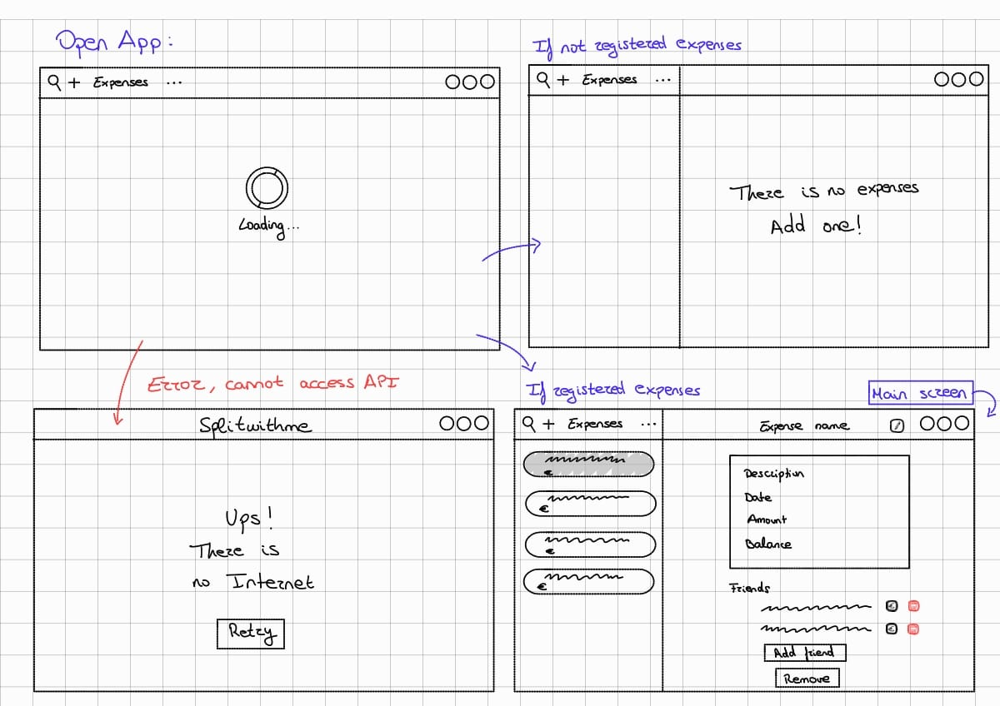
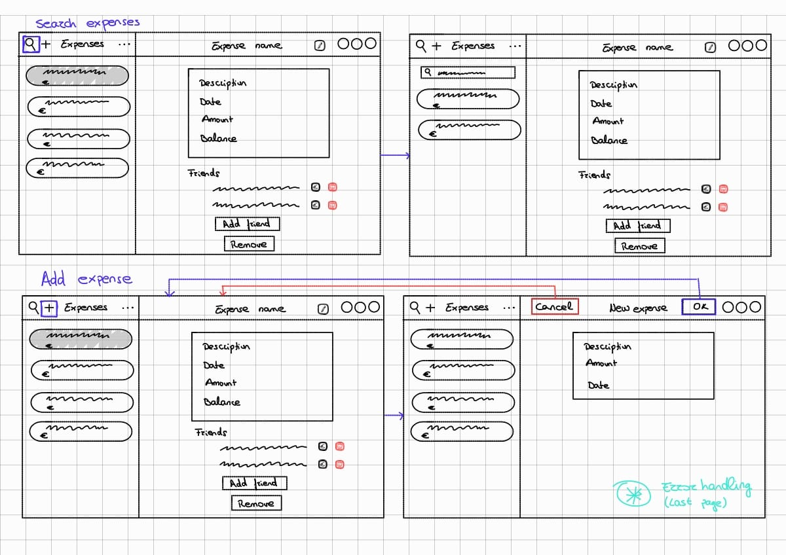
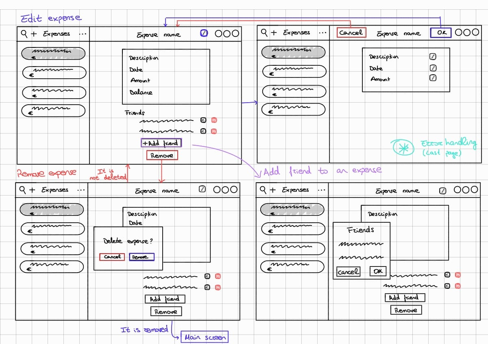
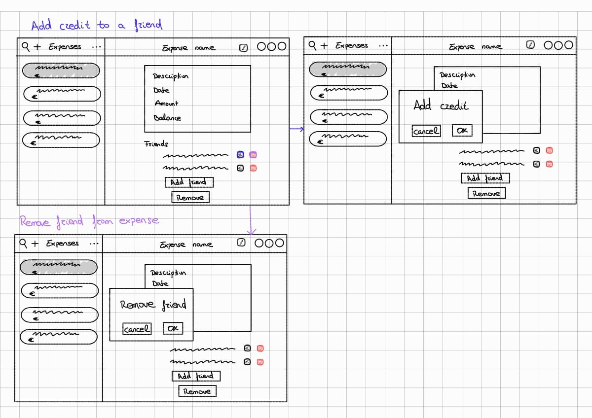
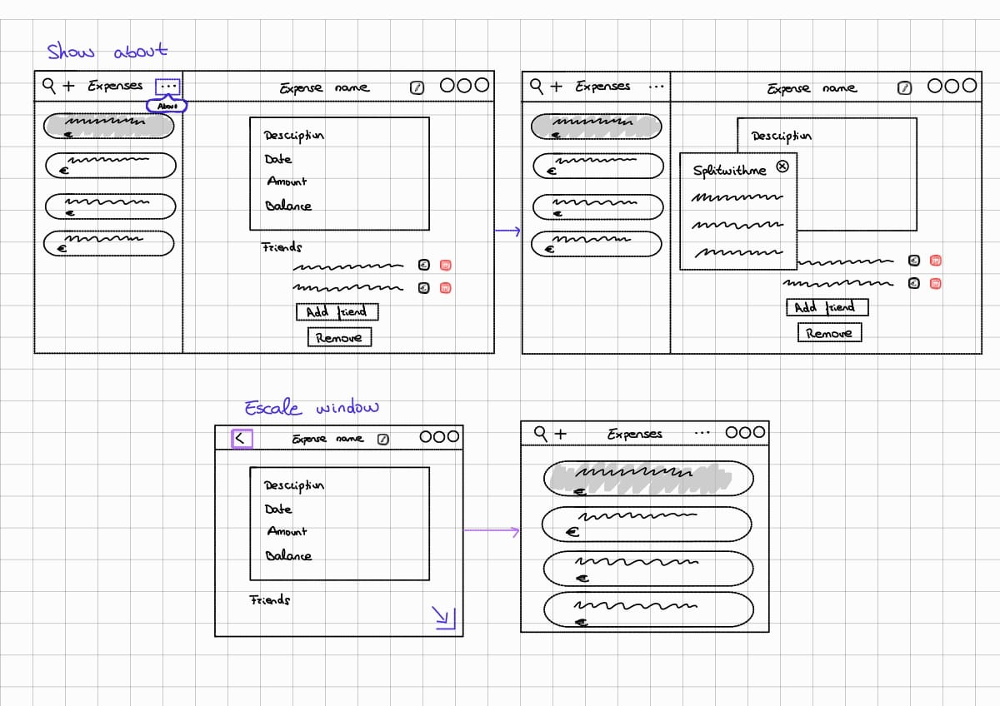
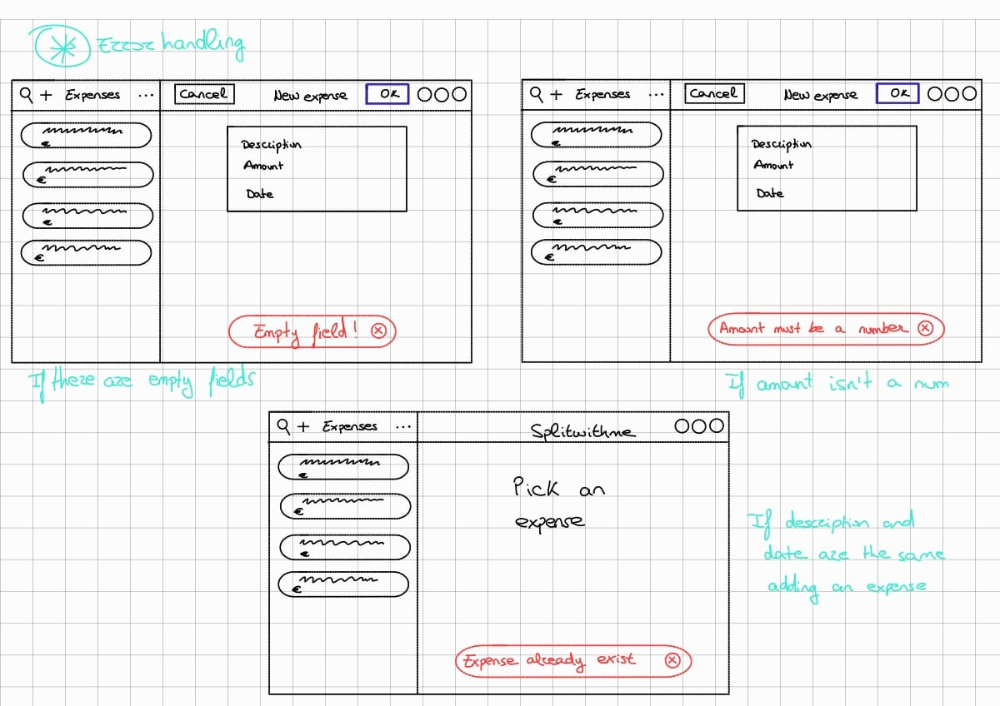
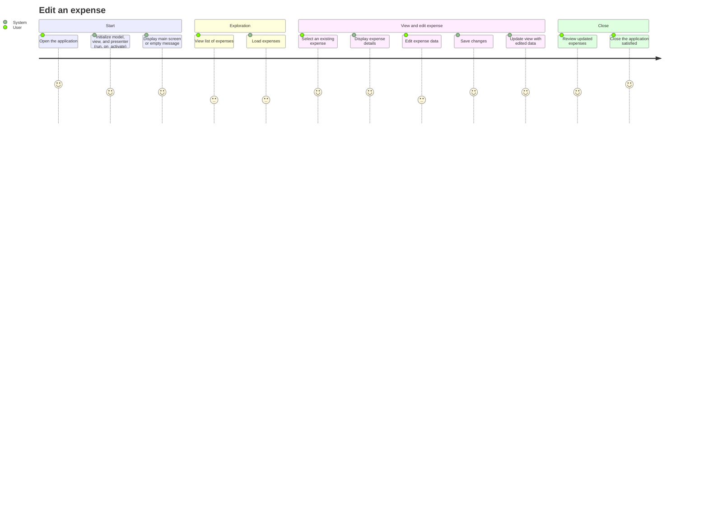
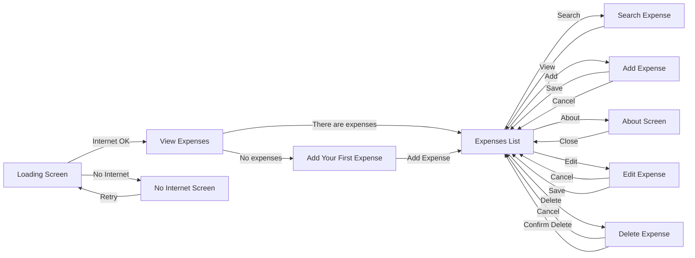

---

# 🔨 Casos de Uso

---
- Añadir/Eliminar gasto
- Ver lista de gastos
- Editar gastos
- Buscar gastos
- Añadir/Eliminar amigos a gasto
- Añadir/Eliminar aportación
- Ver about

---

# ✏️ Wireframes

---

# 🔄 Diagramas dinámicos
---
##  Diagrama User Journey

## Diagrama de flujo  

> Nota: "Loading Screen" y "No Internet Screen" están las vistas hechas pero no
están conectadas al flujo de la aplicación (pendiente para la tarea 2)