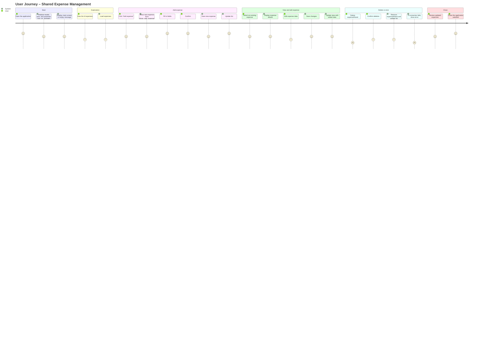
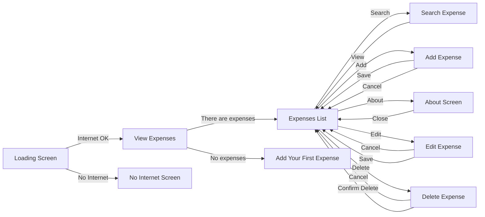

# Diagramas dinámicos
---
## 🙂 Diagrama User Journey

```mermaid
journey
  title User Journey – Shared Expense Management
  section Start
    Open the application: 5: User
    Initialize model, view, and presenter (run, on_activate): 4: System
    Display main screen or empty message: 4: System
  section Exploration
    View list of expenses: 3: User
    Load expenses: 3: System
  section Add expense
    Click "Add expense": 4: User
    Show new expense form (show_add_expense): 4: System
    Fill in fields: 5: User
    Confirm: 5: User
    Save new expense: 4: System
    Update list: 5: System
  section View and edit expense
    Select an existing expense: 4: User
    Display expense details: 4: System
    Edit expense data: 3: User
    Save changes: 4: System
    Update view with edited data: 4: System
  section Delete or error
    Delete expense/friend: 2: User
    Confirm deletion: 3: User
    Remove expense/friend and update list: 3: System
    If connection fails, show error: 2: System
  section Close
    Review updated expenses: 4: User
    Close the application satisfied: 5: User
```

## 🔄 Diagrama de flujo  

```mermaid
flowchart LR

    A[Loading Screen] -->|Internet OK| B[View Expenses]
    A -->|No Internet| C[No Internet Screen]

    B -->|There are expenses| D[Expenses List]
    B -->|No expenses| E[Add Your First Expense]

    D -->|Search| F[Search Expense]
    D -->|Add| G[Add Expense]
    D -->|About| H[About Screen]
    D -->|Edit| I[Edit Expense]
    D -->|Delete| J[Delete Expense]

    I -->|Cancel| D
    I -->|Save| D

    J -->|Cancel| D
    J -->|Confirm Delete| D

    G -->|Save| D
    G -->|Cancel| D

    H --> |Close| D

    F --> |View| D
```
---