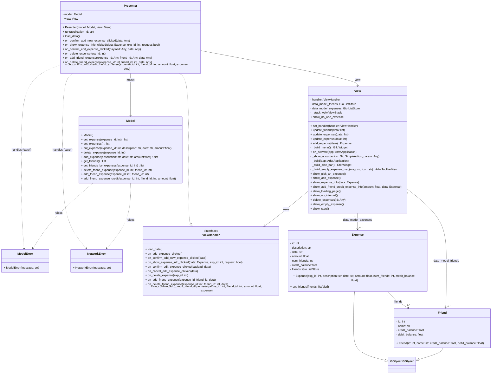
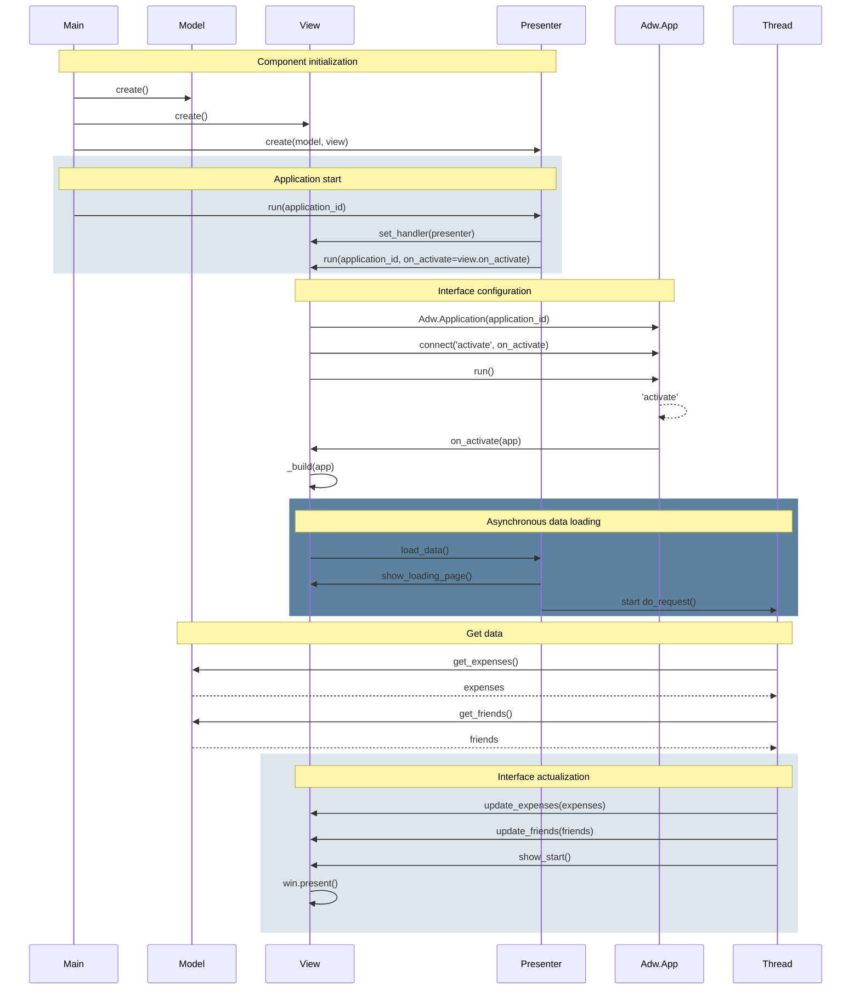
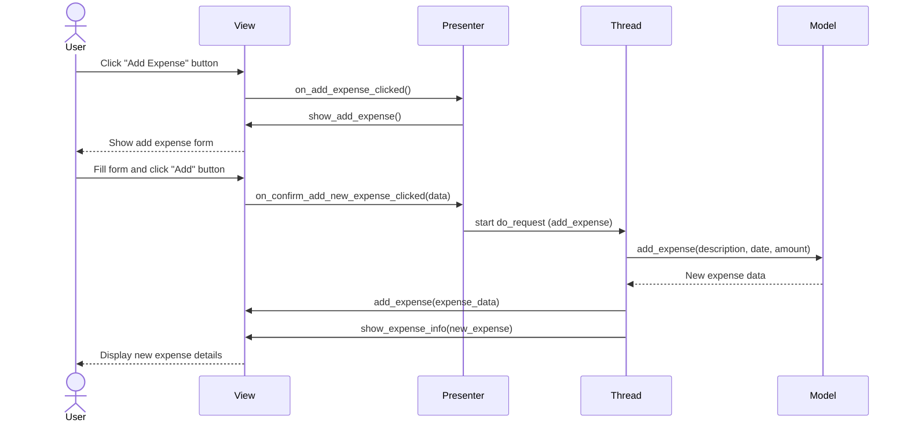
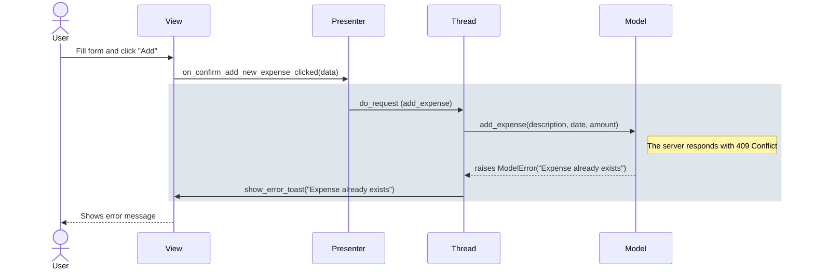

---

# 🧩 Diagrama estático

---

## Diagrama de clases

---

# 🔄 Diagramas dinámicos 

---

## Diagrama de secuencia Init

## Diagrama de secuencia "Click Add Expense"

## Diagrama de secuencia "Error al añadir gasto duplicado"

