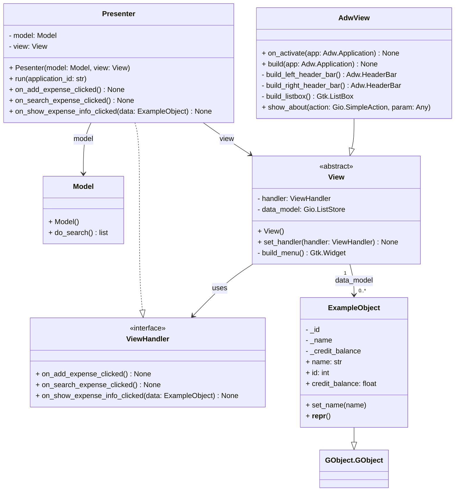
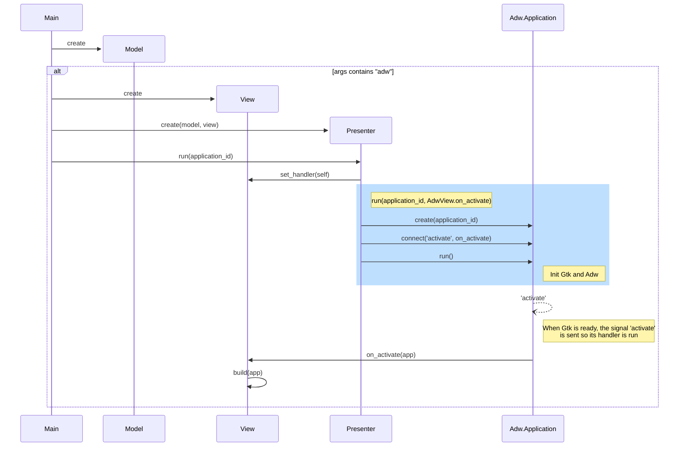

```mermaid

%% DIAGRAMA ESTÁTICO (DIAGRAMA DE CLASES)
classDiagram

    class Presenter {
        - model: Model
        - view: View
        + Pesenter(model: Model, view: View)
        + run(application_id: str)
        + on_add_expense_clicked() None
        + on_search_expense_clicked() None
        + on_show_expense_info_clicked (data: ExampleObject) None
    }

    class Model {
        + Model()
        + do_search() list
    }

    class ViewHandler {
        <<interface>>
        + on_add_expense_clicked() None
        + on_search_expense_clicked() None
        + on_show_expense_info_clicked(data: ExampleObject) None
    }

    class ExampleObject {
        - _id
        - _name
        - _credit_balance
        + name: str
        + id: int
        + credit_balance: float
        + set_name(name)
        + __repr__()
    }

    class View {
        <<abstract>>
        - handler: ViewHandler
        - data_model: Gio.ListStore
        + View()
        + set_handler(handler: ViewHandler) None
        - build_menu() Gtk.Widget
    }

    class AdwView {
        + on_activate(app: Adw.Application) None
        + build(app: Adw.Application) None
        - build_left_header_bar() Adw.HeaderBar
        - build_right_header_bar() Adw.HeaderBar
        - build_listbox() Gtk.ListBox
        + show_about(action: Gio.SimpleAction, param: Any)
    }

    %% Relationships
    View "1" --> "0..*" ExampleObject : data_model
    View --> ViewHandler : uses
    AdwView --|> View
    ExampleObject --|> GObject.GObject
    Presenter ..|> ViewHandler
    Presenter --> Model : model
    Presenter --> View : view

```

```mermaid

%% DIAGRAMA DINÁMICO (DIAGRAMA DE SECUENCIA)
sequenceDiagram
    participant app as Main

    create participant model as Model
    app ->> model: create

    alt args contains "adw"
        create participant view as View
        app ->> view: create
        create Participant Presenter
        app ->> Presenter: create(model, view)
        app ->> Presenter: run(application_id)
        Presenter ->> view : set_handler(self)        
        rect rgb(191, 223, 255)
            create participant adw as Adw.Application
            note right of Presenter: run(application_id, AdwView.on_activate)
            Presenter ->> adw : create(application_id)
            Presenter ->> adw : connect('activate', on_activate)
            Presenter ->> adw : run()
            note right of adw: Init Gtk and Adw
        end
        adw --) adw : 'activate'
        note right of adw : When Gtk is ready, the signal 'activate' <br> is sent so its handler is run
        adw ->> view: on_activate(app)
        view ->> view : build(app)
    end
        
```

