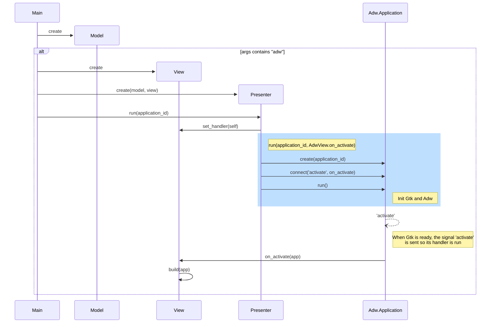

```mermaid

%% DIAGRAMA ESTÁTICO (DIAGRAMA DE CLASES)
classDiagram

    class Presenter {
        - model: Model
        - view: View
        + Pesenter(model: Model, view: View)
        + run(application_id: str)
        + get_friends_by_expense(expense_id: int) list[dict] 
        + on_add_expense_clicked() 
        + on_confirm_add_new_expense_clicked(data: Any) 
        + on_cancel_add_expense_clicked() 
        + on_search_expense_clicked() 
        + on_show_expense_info_clicked(data: Expense)
        + on_edit_expense_clicked(data: Any)
        + on_confirm_edit_expense_clicked(payload: Any, data: Any)
        + on_cancel_edit_expense_clicked(data: Any)
        + on_delete_expense(id: int)
        + on_delete_friend_expense(expense_id: int, friend_id: int, data: Expense)
    }

    class Model {
        + Model()
        + get_expense(expense_id: int) list
        + get_expenses() list 
        + put_expense(expense_id: int, description: str, date: str, amount:float) bool
        + delete_expense(expense_id: int) bool
        + add_expense(description: str, date: str, amount:float) dict
        + get_friends() list
        + get_friend_by_id(friend_id: int) dict
        + get_friends_by_expense(expense_id: int) list
        + add_friend(name: str, credit_balance: float, debit_balance: float) dict
        + delete_friend(friend_id: int) bool
        + delete_friend_expense(expense_id: int, friend_id: int) bool
    }

    class ViewHandler {
        <<interface>>
        + on_add_expense_clicked() 
        + on_search_expense_clicked() 
        + on_show_expense_info_clicked(data: Expense) 
        + on_confirm_add_new_expense_clicked(data: Expense) 
        + on_cancel_add_expense_clicked() 
        + on_cancel_edit_expense_clicked(data: Expense) 
        + on_edit_expense_clicked(data: Expense) 
        + on_confirm_edit_expense_clicked(payload, data: Expense) 
        + on_delete_expense(id: int) 
        + on_delete_friend_expense(expense_id: int, friend_id: int, data: Expense) 
        + get_friends_by_expense(expense_id: int) list[dict]
    }

    class Friend {
        - id: int
        - name: str
        - credit_balance: float
        - debit_balance: float
    }

    class Expense {
        - id: int
        - description: str
        - date: str
        - amount: float
        - num_friends: int
        - credit_balance:float
        - friends: Gio.ListStore
        + set_friends(friends: list[dict])
    }

    class View {
        <<abstract>>
        - handler: ViewHandler
        - data_model_friends: Gio.ListStore
        - data_model_expenses: Gio.ListStore
        - entry_description
        - entry_date
        - entry_amount
        - entry_friends
        - entry_credit_balance
        + View()
        + set_handler(handler: ViewHandler) 
        + update_friends(data: list) 
        + update_expenses(data: list) 
        + update_expense(data: dict) 
        + add_expense(item: dict) Expense
        + delete_expense(id: int) 
        + build_menu() Gtk.Widget
        + show_empty_expense() 
        + show_no_one_expense() 
        + show_add_expense() 
        + show_search_expense() 
        + show_expense_info(data: Expense) 
        + show_edit_expense_info(expense: Expense) 
        + clear_expenses_list_selection() 
        + show_edited_expense_info(expense: Expense) 
        + select_last_expenses_list_selection() 
        + show_n_one_expense
        + show_loading() 
        + show_no_internet() 
        + show_pick_an_expense() 
        + show_no_one_expense()
        + set_sidebar_sensitive(boolean: bool)
    }

    class AdwView {
        - window: Adw.ApplicationWindow
        - _expenses_list: Gtk.ListBox
        - _about: Adw.AboutDialog
        - _sidebar_header: Adw.HeaderBar
        - _split_view: Adw.NavigationSplitView
        - _content_page: Adw.NavigationPage
        - _sidebar_page: Gtk.Widget
        - _form_entry_description
        - _form_entry_amount
        - _form_entry_date
        - _stack: Adw.ViewStack
        + on_activate(app: Adw.Application) 
        + clear_expenses_list_selection() 
        + select_last_expenses_list_selection() 
        + set_sidebar_sensitive(boolean: bool)
        - _build(app: Adw.Application) 
        - _build_side_bar() Gtk.Widget
        - _build_empty_expense_msg() Adw.ToolbarView
        - _build_loading_page() Adw.ToolbarView
        - _build_no_internet_page() Adw.ToolbarView
        - _build_clamp_content(child: Gtk.Widget) Adw.Clamp
        - _build_calendar(date: str) Adw.ActionRow
        - _build_edit_expense(expense: Expense) Adw.ToolbarView
        - _build_add_expense() Adw.ToolbarView
        - _build_expense_info(data: Expense) Adw.ToolbarView
        + show_about(action: Gio.SimpleAction, param: Any) 
        + show_pick_an_expense()
        + show_no_one_expense()
        + show_add_expense() Gtk.Box
        + show_search_expense()
        + show_expense_info(expense: Expense)
        + show_edited_expense_info(expense: Expense)
        + show_edit_expense_info(expense: Expense)
        + show_loading()
        + show_no_internet()
        + delete_expense(id: int)
        + show_empty_expense()
    }

    %% Relationships
    View "1" --> "0..*" Friend : data_model_friends
    View "1" --> "0..*" Expense : data_model_expenses
    Expense "1" --> "0..*" Friend : friends
    View --> ViewHandler : uses
    AdwView --|> View
    Friend --|> GObject.GObject
    Expense --|> GObject.GObject
    Presenter ..|> ViewHandler
    Presenter --> Model : model
    Presenter --> View : view
    
```

```mermaid

%% DIAGRAMA DINÁMICO (DIAGRAMA DE SECUENCIA)
sequenceDiagram
    participant app as Main

    create participant model as Model
    app ->> model: create

    alt args contains "adw"
        create participant view as View
        app ->> view: create
        create Participant Presenter
        app ->> Presenter: create(model, view)
        app ->> Presenter: run(application_id)
        Presenter ->> view : set_handler(self)        
        rect rgb(191, 223, 255)
            create participant adw as Adw.Application
            note right of Presenter: run(application_id, AdwView.on_activate)
            Presenter ->> adw : create(application_id)
            Presenter ->> adw : connect('activate', on_activate)
            Presenter ->> adw : run()
            note right of adw: Init Gtk and Adw
        end
        adw --) adw : 'activate'
        note right of adw : When Gtk is ready, the signal 'activate' <br> is sent so its handler is run
        adw ->> view: on_activate(app)
        view ->> view : build(app)
    end
        
```

