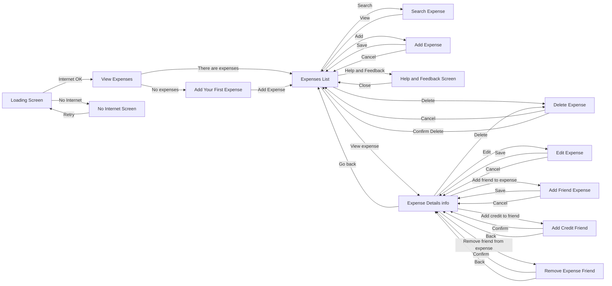
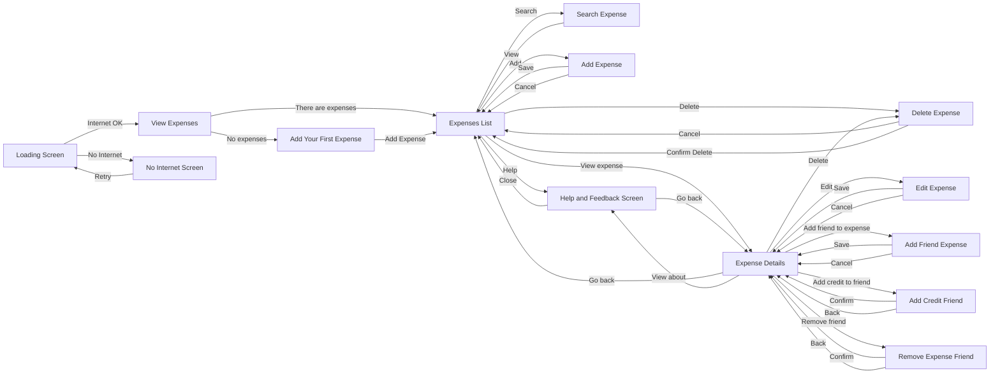

---

# 🔨 Use Cases

---
- Add/Remove Expense
- View Expenses List
- Edit Expense
- Search Expenses
- Add/Remove Friends to/from Expense
- Add/Remove Credit
- View Help

---

# ✏️ Wireframes
## Mobile Wireframes

## Tablet Wireframes

---

# 🔄 Flowcharts

## Mobile Flowchart

## Tablet Flowchart
