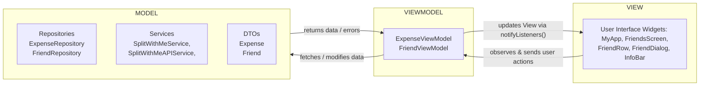
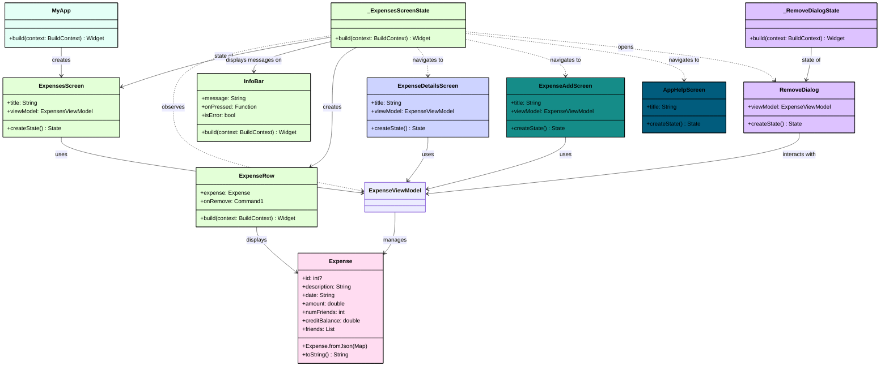
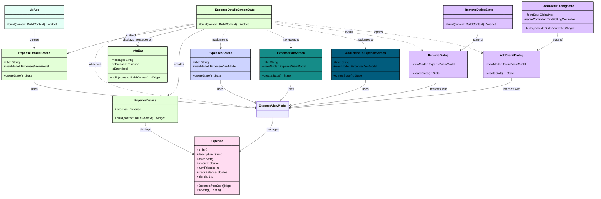
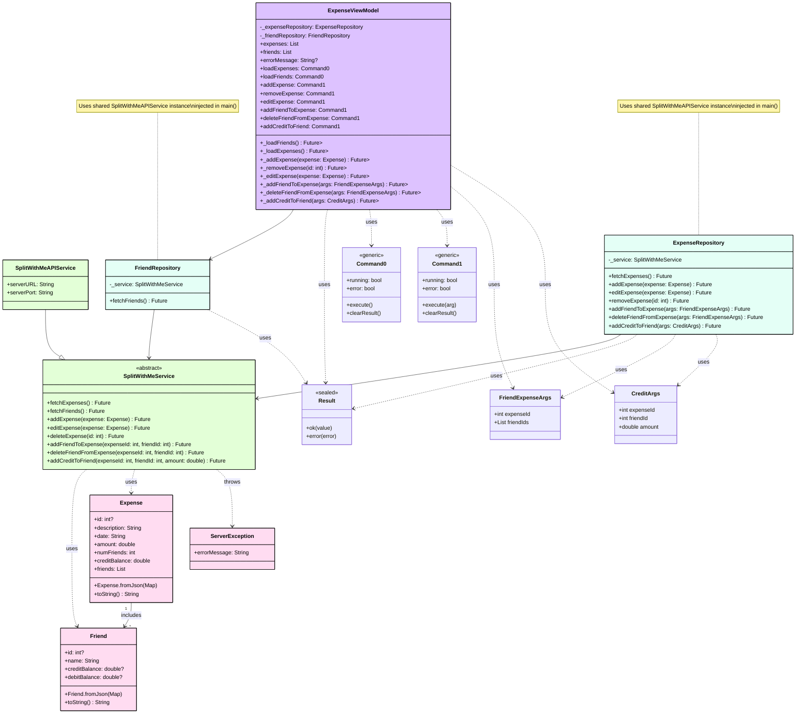
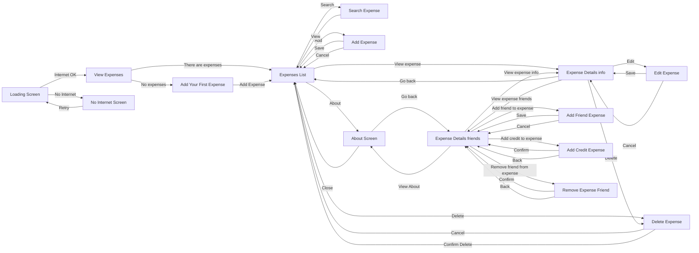
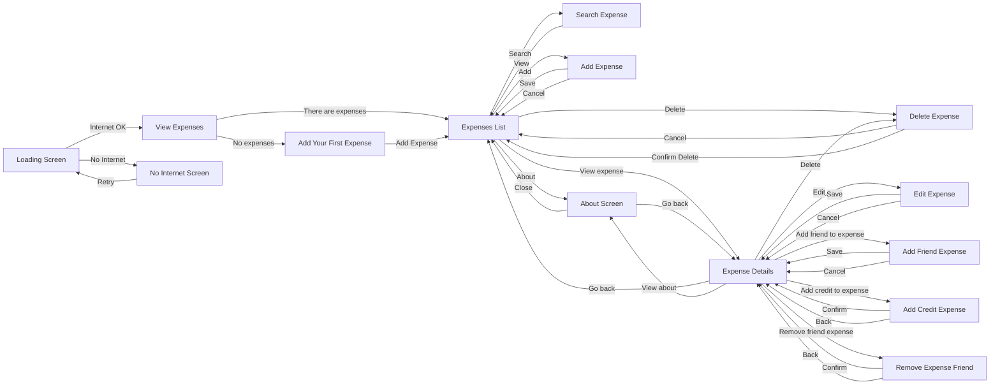
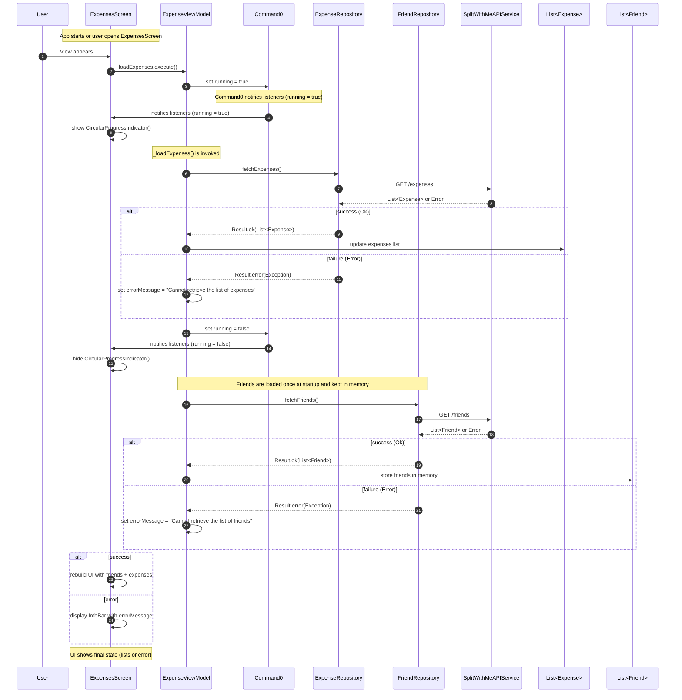

## Flowchart

## Class Diagram: View: ExpensesScreen

> [!NOTE] Note
Shows only the details of the `ExpensesScreen` to keep things simple.

## Class Diagram: View: ExpenseDetailsScreen

> [!NOTE] Note
Shows only the details of the `ExpenseDetailsScreen` to keep things simple.

## Class diagram: ViewModels, Repositories and Services

## Mobile Flowchart

## Tablet Flowchart

## Sequence diagram: Load initial data

